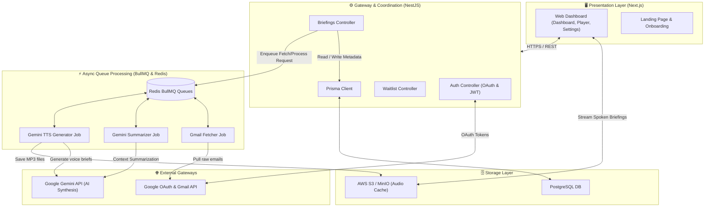

# 🎧 Inbox FM

<div align="center">
  
  
  
  
</div>

<p align="center">
  <strong>"The open-source audio-first inbox. We turn cluttered emails into a daily morning podcast."</strong>
</p>

---

## ⚡ Overview

**Inbox FM** is a premium, open-source personal briefing assistant. Instead of spending your first 30 minutes of the morning scanning hundreds of newsletter updates, project alerts, and sales threads, Inbox FM securely indexes your inbox, groups them intelligently, synthesizes key details using **Google Gemini 3.5**, and narrates them to you as a high-fidelity daily spoken briefing.

---

## 🏗️ System Architecture

Inbox FM is built as a production-grade TypeScript monorepo designed for high throughput and reliable background processing.



### Architectural Highlights
- **Rate-Limit Safe Rotation**: Supports up to three distinct Gemini API keys, automatically rotating them to safeguard against API quota failures.
- **Strict Decoupled Queues**: BullMQ offloads Gmail connection fetches, text summarization, and heavy audio synthesis tasks to background workers, ensuring 100ms API response times.
- **Secure Encrypted Tokens**: Gmail connection OAuth refresh tokens are stored in the database encrypted via `AES-256-GCM` using custom hardware keys.

---

## ✨ Features Breakdown

### 📬 Smart Email Syncer
- Integrates securely via Google OAuth.
- Fetches and classifies threads into categories: `URGENT`, `ACTION_REQUIRED`, `MEETINGS`, and `NEWSLETTERS`.

### 🎙️ AI Spoken briefings
- Conversational audio generation powered by Google Gemini TTS.
- Select from multiple custom voice personas:
  - 📡 **Newsroom**: Structured, authoritative, anchor-style reading.
  - ☕ **Friend**: Conversational, lighthearted, and casual.
  - 🏎️ **Speedster**: Ultra fast, high-density, action-item-focused recap.

### 📅 Action Item Automation
- Automatically parses and extracts project agreements, calendar updates, and requests.
- Offers one-click scheduling interfaces for events.

---

## 🛠️ Tech Stack & Directory Structure

```
inbox-fm/
├── apps/
│   ├── api/          # NestJS application (controllers, modules, prisma schemas)
│   └── web/          # Next.js 14 client (pages, player components, styles)
├── packages/
│   └── shared/       # Shared TypeScript types, utility helpers, and schemas
```

* **Frontend**: Next.js 14 (App Router), TailwindCSS, Framer Motion, Phosphor Icons.
* **Backend**: NestJS, Prisma ORM, BullMQ, Redis.
* **Storage**: PostgreSQL (Relational Database), MinIO/S3 (Object Store for Audio caching).
* **AI Engine**: Gemini 3.5 Flash & Pro, Google TTS.

---

## 🚀 Quick Start Guide

### 📋 Prerequisites

- **Node.js**: `18.x` or higher
- **pnpm**: `8.x` or higher
- **Docker & Docker Compose**: installed and running

### 🔧 Step-by-Step Installation

1. **Clone and Install Workspace Dependencies**
   ```bash
   pnpm install
   ```

2. **Spin Up Infrastructural Services (PostgreSQL + Redis + MinIO)**
   ```bash
   pnpm docker:up
   ```

3. **Database Configuration & Migrations**
   ```bash
   # Generate Prisma client bindings
   pnpm db:generate

   # Apply schema database migrations
   pnpm db:migrate
   ```

4. **Environment Setups**
   Set up your keys and secrets by copying the configurations:
   * **API Gateway Configuration**: Copy `apps/api/.env.example` ➡️ `apps/api/.env`
   * **Web Client Configuration**: Copy the web section in [.env.example](file:///K:/ifn/.env.example) to `apps/web/.env.local`

5. **Start Dev Server**
   ```bash
   pnpm dev
   ```
   * Frontend: `http://localhost:3000` | Backend Gateway: `http://localhost:3001`

---

## 🔑 Access Control Bypass (Testing)

> [!TIP]
> **Waitlist & Access Code Requirement is Disabled**
> We modified the registration process so that anyone can register and verify accounts immediately. No waitlist validation or access code is required for email/password signup or direct Google OAuth login.

### Re-Enabling Access Codes
If you want to run the platform in private beta mode:
1. Revert changes in `apps/api/src/modules/auth/auth.service.ts` to re-enable waitlist verification.
2. The platform automatically generates `IFM-XXXXXXXX` access codes.
3. For testing, you can associate the approved email with the active bypass code: **`IFM-TECHGENESIS`**.

---

## 📄 License

Distributed under the MIT License. See [LICENSE](file:///K:/ifn/LICENSE) for more details.
